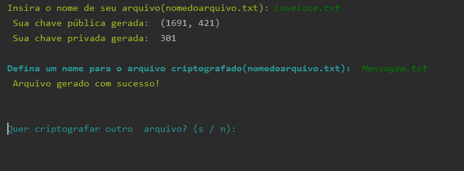
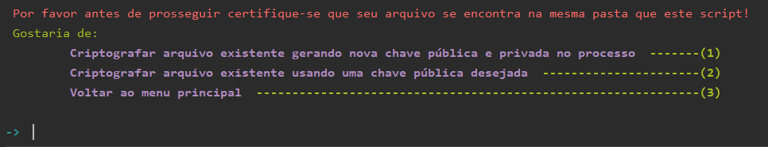
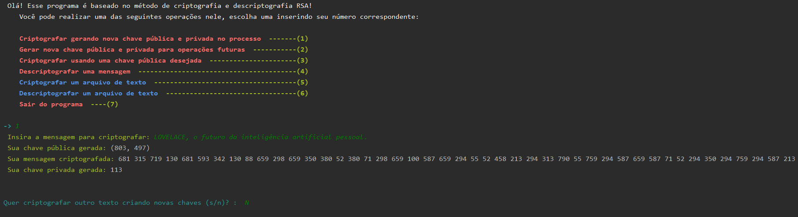
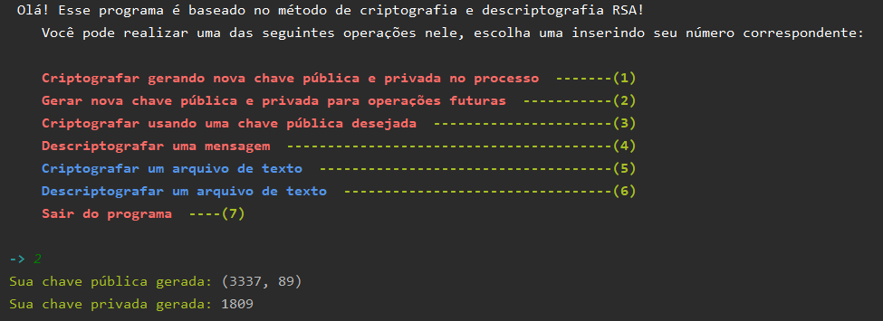

# APS-Segundo-Semestre
## APS Desenvolvida no segundo semestre da faculdade. O projeto era um sistema de criptografia em Python. 
 O algorítimo desenvolvido tem como objetivo apresentar o impacto da criptografia em si nos
tempos modernos, com o intuito explorar os diversos tipos possíveis de codificação
e de criptografia, a fim de expor seus usos práticos, relevâncias e fundamentações,
visando esses temas de forma clara, demonstrando a importância da segurança de
informação.
Além de expandir o conhecimento sobre a área através de pesquisa, foi
realizada a estruturação de um código funcional que mostra e eficiência do sistema
criptográfico focado neste trabalho, este sendo o tipo RSA, que tem seus conceitos
abordados no decorrer da documentação.
O programa desenvolvido tem o intuito de colocar os conhecimentos
adquiridos durante a pesquisa e também no decorrer deste curso em prática e a
teste, afim de julgar a capacidade de codificação de um algoritmo que realize a
função designada não só com eficácia, mas sim eficiência.
Por meio desse contato em primeira mão, é esperado uma aprendizagem
perceptiva sobre a importância da criptografia e segurança de dados, sua
considerada complexidade e importante função, que tem desempenhado um papel
fundamental nos dias de hoje.

### Esse projeto tem uma documentação contendo 37 páginas! Se quiser ver, é só me mandar mensagem!

#### Exemplos de funcionamento do programa:

